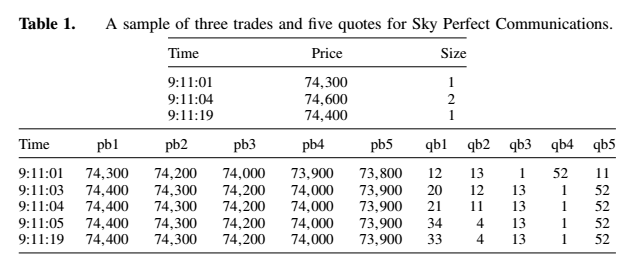

```{r setup, include=FALSE}
knitr::opts_chunk$set(echo = TRUE)
options(scipen = 999, digits = 6, digits.secs=6)
library(ggplot2)
library(data.table)
library(lubridate)
library(latex2exp)
#futile.logger::flog.threshold(futile.logger::WARN, 'obadiah')
```


```{r, include=FALSE}
start.time <- ymd_hms("2014-09-01 10:00:00+03")
end.time <- ymd_hms("2014-09-05 19:00:00:+03")

pair <- 'SBERRUR'
exchange <- 'Moex'

```


```{r connect-to-database, eval=FALSE, include=FALSE}
# This code is required once in order to  load depth and trades from OBADiah database and save them locally

con <- obadiah::connect("192.168.3.5", "5433", dbname = "obadiah-devel", use.cache=F)
depth <- obadiah::depth(con, start.time,end.time,exchange, pair,tz='Europe/Moscow')
trades <- obadiah::trades(con, start.time, end.time , exchange, pair, tz="Europe/Moscow")[, .(timestamp, price, volume, direction, maker, taker)]
save(trades, depth, file ="stochastic-order-book-model.bz2")
```


```{r, include=FALSE, echo=FALSE}
load("stochastic-order-book-model.bz2")
```

From [@cont2010]:

> We propose a continuous-time stochastic model for the dynamics of a limit order book. The model strikes a balance between three desirable features: it can be estimated easily from data, it **captures key empirical properties of order book dynamics**, and its analytical tractability allows for fast computation of various quantities of interest without resorting to simulation. We describe a simple parameter estimation procedure based on high-frequency observations of the order book and illustrate the results on data from the Tokyo Stock Exchange. Using simple matrix computations and Laplace transform methods, we are able to efficiently **compute probabilities** of various events, **conditional on the state of the order book**: an increase in the midprice, execution of an order at the bid before the ask quote moves, and execution of both a buy and a sell order at the best quotes before the price moves. Using high-frequency data, we show that our model can effectively capture the short-term dynamics of a limit order book. We also **evaluate the performance of a simple trading strategy based on our results.**

In this notebook we will use the data from OBADIah database to analyze to which degree the proposed model is able to capture key empirical properties of order book dynamics and, if yes, whether it may be used for trading today. 


# 1. A Continuous-Time Model for a Stylized Limit Order Book


## 1.1 Limit Order Books


From [@cont2010]:

> We consider a market where limit orders can be placed on a price grid $\{1, \ldots ,n\}$ representing multiples of a price tick. The upper boundary $n$ is chosen large enough so that it is highly unlikely that orders for the stock in question are placed at prices higher than $n$ within the time frame of our analysis. Because **the model is intended to be used on the time scale of hours or days**, this finite boundary assumption is reasonable.

Note that the model is intended to be used on the time scale of hours and days. 

From [@cont2010]:

> We track the state of the order book with a continuous-time process $\mathbf{X}(t) \equiv (X_1(t), \ldots , X_n(t))_{t \geq 0}$, where $|X_p(t)|$ is the number of outstanding limit orders at price $p$, $1 \leq p \leq n$. If $X_p(t) < 0$, then there are $-X_p(t)$ bid orders at price $p$; if  $X_p(t) > 0$, then there are $X_p(t)$ ask orders at price $p$. 

As further described below the authors assume that all orders are of unit size and in empirical examples they take this unit to be the average size (in lots) of limit orders observed for the asset.

From [@cont2010]:

> The ask price $p_A(t)$ at time $t$ is defined by $$p_A(t) \equiv \inf\{p=1,\ldots,n, X_p(t) > 0\} \lor (n+1)$$  Similarly, the bid price is defined by $$p_B(t) \equiv \sum\{p=1,\ldots,n, X_p(t) < 0\} \lor 0$$  

The authors emphasize that when there are no ask orders in the book the ask price is set to $n + 1$, and when there are no bid orders in the book the bid price is set to $0$. In our opinion, the ask price shold be "+infinity" when there are not ask orders in the book to reflect the fact that you can't buy anything for any money.

From [@cont2010]:

> Because most of the trading activity takes place in the vicinity of the bid and ask prices, it is useful to keep track of the number of outstanding orders at a given distance from the bid/ask. To this end, we define 
$$
 Q_i^B(t) = \begin{cases} X_{p_A(t) - i}(t), & 1  \leq i < p_A(t) \\  0, & p_A(t) \leq i < n \end{cases}
 (\#eq:que-b-def)
$$ the number of buy orders at a distance $i$ from the ask, and $$
Q_i^A(t) = \begin{cases} X_{p_B(t) + i}(t), & 1 \leq i \leq n - p_B(t)  \\ 0, & n - p_B(t) \leq i < n  \end{cases}
$$ the number $Q_i^A(t)$ of sell orders at a distance $i$ from the bid 

It is often said that the dynamics of a limit order book resembles in many aspects that of a queuing system. Limit orders wait in a queue to be executed against market orders (or canceled). We guess that it explains the choice of the letter $Q$ in $Q_i^B(t)$ and $Q_i^A(t)$. 


## 1.2 Dynamics of the Order Book

Remember that the state of the order book is tracked with a continuous-time process $\mathbf{X}(t) \in \mathbb{Z}^n$

From [@cont2010]:

> For a state  $\mathbf{X} \in \mathbb{Z}^n$  and  $1 \leq p \leq n$, define  
$$ \mathbf{X}^{p \pm 1} \equiv \mathbf{X} \pm (0, \ldots, 1, \ldots, 0)$$
where $1$ in the vector on the right-hand side is in the $p$th component. Assuming that all orders are of unit size (in empirical examples we will take this unit to be the average size of limit orders observed for the asset),
>
> * a limit buy order at price level $p < p_A$ increases the quantity at level $p$: $\mathbf{X} \rightarrow \mathbf{X}^{p-1}$
> * a limit sell order at price level $p > p_B$ increases the quantity at level $p$: $\mathbf{X} \rightarrow \mathbf{X}^{p+1}$
> * a market buy order decreases the quantity at the ask price: $\mathbf{X} \rightarrow \mathbf{X}^{p_A(t)-1}$
> * a market sell order decreases the quantity at the bid price: $\mathbf{X} \rightarrow \mathbf{X}^{p_B(t)+1}$
> * a cancellation of an outstanding limit buy order at price level $p < p_A$ decreases the quantity at level $p$: $\mathbf{X} \rightarrow \mathbf{X}^{p+1}$
> * a cancellation of an outstanding limit sell order at price level $p > p_B$ decreases the quantity at level $p$: $\mathbf{X} \rightarrow \mathbf{X}^{p-1}$
> 
> The evolution of the order book is thus driven by the incoming flow of market orders, limit orders, and cancellations at each price level, each of which can be represented as a counting process. 

Let's analyze under which circumstances the model described above is able to capture adequately the dynamics of order book.  


Consider a single bid price level $p_0$. Suppose that order's volume $v$ has been drawn from a normal distribution as, 
$$
v \sim v_0\mathcal{N}(\mu, \sigma)
$$

where $v_0$=10, $\mu$=20 and $\sigma$ = 10. All placed orders have been eventually cancelled (in a random order). Table \@ref(tab:binom-sample) shows the first orders placements and cancellations and black line on the figure \@ref(fig:sample-Q-dynamics) shows overall dynamics of $Q_{p_0}^B(t)$. 

```{r include=FALSE}
set.seed(123)
n <-100 
volumes <- round(rnorm(n, 20, 10)*10)

order.flow <- function(volumes) {
  a <- 10
  to.be.removed <- c(1:a)
  output <- c(volumes[1:a])
  for(i in (a+1):n) {
    #print(paste0("i=",i))
    to.be.removed <- c(to.be.removed, i)
    output <- c(output, volumes[i])
    if(rbinom(1,1,0.8) > 0)
      j <- rbinom(1, length(to.be.removed), 0.1)
    else 
      j <- 0
    if(j > 0) {
      #print(paste0("i=", i," j=",j, " removes=", to.be.removed[j], " vol=", -volumes[to.be.removed[j]]))
      output <- c(output, -volumes[to.be.removed[j]])
      idx <- rep(TRUE, length(to.be.removed))
      idx[j] <- FALSE
      to.be.removed <- to.be.removed[idx]
    }
  }
  #for(j in to.be.removed) {
  #  output <- c(output, -volumes[j])
  #}
  data.table(time=seq_along(output),volume=output)
}

flow <- order.flow(volumes)
unit.size <- round(flow[ volume > 0, mean(volume)])
price.level <- flow
price.level[volume > 0,volume.units := 1]
price.level[volume < 0,volume.units := -1]
price.level[, balance := cumsum(volume)]
price.level[, balance.units := cumsum(volume.units)]
price.level[, balance.model := balance.units*unit.size]

```

Now, in accordance with the above description, we assume that all placed orders are of "unit size" (column `volume.units`) and calculate $Q_{p_0}^B(t)$ in units (column `balance.units`).  Then we multiply `balance.units` by "average size of limit orders observed" (in our case `r unit.size`) and get the value in column `balance.model' and red line on the figure \@ref(fig:sample-Q-dynamics). We see that black and red line are quite close to each other, so the model is a good representation of the actual data in this case. 


```{r binom-sample, echo=FALSE}
knitr::kable(head(flow,12), caption="Sample order flow and resulting balance on a single price level.")
```


```{r sample-Q-dynamics, echo=FALSE, fig.cap="The actual (black) and model (red) dynamics of the bid price level queue size using the artificial order flow drawn from a normal distribution. The model is a good representation of reality."}
ggplot(price.level, aes(x=time)) + geom_step(aes(y=balance)) + geom_step(aes(y=balance.model), colour="red") + ylab(TeX("$Q_{p_0}^B(t)$")) + xlab(TeX("$t$")) + ggtitle("Normal distribution of limit order volumes")
```


Now suppose that order's volume $v$ has been drawn from a power-low distribution as, 
$$
v \sim x^{-(\alpha-1)}
$$

where $\alpha$ = 3. As figure \@ref(fig:sample-Q-dynamics-power-law) shows, the fit is not so good now. 

```{r include=FALSE}
set.seed(123)
n <-100 
volumes <- 10*(1-runif(n))**(-1/2)
flow <- order.flow(volumes)
unit.size <- round(flow[ volume > 0, mean(volume)])
price.level <- flow
price.level[volume > 0,volume.units := 1]
price.level[volume < 0,volume.units := -1]
price.level[, balance := cumsum(volume)]
price.level[, balance.units := cumsum(volume.units)]
price.level[, balance.model := balance.units*unit.size]
price.level
```

```{r sample-Q-dynamics-power-law, echo=FALSE, fig.cap="The actual (black) and model (red) dynamics of the bid price level queue size using the artificial order flow drawn from a power-law distribution. The model is not a good representation of reality."}
ggplot(price.level, aes(x=time)) + geom_step(aes(y=balance)) + geom_step(aes(y=balance.model), colour="red") + ylab(TeX("$Q_{p_0}^B(t)$")) + xlab(TeX("$t$")) + ggtitle("Power-law distribution of limit order volumes")
```

We can conclude that the ability of the model to reproduce the empirical behaviour of order book queues depends on the distribution of the limit orders's volume. 

From [@cont2010]:

> It is empirically observed [@bouchaud2002] that incoming orders arrive more frequently in the vicinity of the current bid/ask price and the rate of arrival of these orders depends on the distance to the bid/ask. To capture these empirical features in a model that is analytically tractable and allows computation of quantities of interest in applications, most notably conditional probabilities of various events, we propose a stochastic model where the events outlined above are modelled using independent Poisson processes. More precisely, we assume that for $i \geq 1$, 
>
> * Limit buy (respectively sell) orders arrive at a distance of $i$ ticks from the opposite best quote at independent, exponential times with rate $\lambda(i)$,
> * Market buy (respectively sell) orders arrive at independent, exponential times with rate $\mu$,
> * Cancellations of limit orders at a distance of $i$ ticks from the opposite best quote occur at a rate proportional to the number of outstanding orders: If the number of outstanding orders at that level is $x$, then the cancellation rate is $\theta(i)x$.
> * The above events are mutually independent.

It shold be noted that while the majority of the market orders hits only the best price level as we showing below, there is a notable amount of cases when market order hits two or more levels. We represent these 'multilevel' market orders as a sequence of 'best price market orders' but those are not independ though. 


# 2. Parameter estimation

## 2.1 Description of the Data Set

### Analysis of the Data Set used in the article

From [@cont2010]:

> Our data consist of time-stamped sequences of trades (market orders) and quotes (prices and quantities of outstanding limit orders) for the five best price levels on each side of the order book, for stocks traded on the Tokyo stock exchange over a period of 125 days (Aug.–Dec. 2006). 

Note that it is not correct to say that a trade and a market orders are the same thing. The [definition](https://www.investopedia.com/terms/m/marketorder.asp)  of a market order implies that a single market order may generated several trades.  

From [@cont2010]:

> In Table 1, we display a sample of three consecutive trades for Sky Perfect Communications. Each row provides the time, size, and price of a market order. We also display a sample of Level II bid-side quotes. Each row displays the five bid prices (pb1, pb2, pb3, pb4, pb5), as well as the quantity of shares bid at these respective prices (qb1, qb2,qb3, qb4, qb5).

Figure \@ref(fig:sample-sky-data) shows Table 1 from the article :

```{r sample-sky-data, fig.cap="A copy of Table 1 from the article", echo=FALSE}

```

The sample seems to be an incomplete one.  A direction of a trade (i.e. buy or sell) is not shown, the currency used is not specified, a tick size is not provided, and it is not even clear whether 74,300 means 74 thousands 300 hundreads or 74.30. The total number of records in the data set is not specified either.

Sky Perfect Communication ceased in 2007 due to [merger with JSAT Corporation](https://www.skyperfectjsat.space/en/company/mission/) so today it is difficult to find the information about prices of its shares in 2006. Yahoo Finance tell us that "close" price of SKY Perfect JSAT Holdings Inc. (9412.T) on August 22, 2006 was [742.50 JPY](https://finance.yahoo.com/quote/9412.T/history?period1=1154390400&period2=1164931200&interval=1d&filter=history&frequency=1d), which is either ten times higher or hundread times lower than the average price in the Table 1. 

If we used today's [trading rules](https://www.jpx.co.jp/english/equities/trading/domestic/07.html) of domestic stocks at Japan Exchange Group, we would think that the tick size would be 0.1 JPY if the share price were 74.30 or 5 JPY if the share price were 74300.

Assuming that the minimal price change in Table 1 equals to the tick size and the price is 74300 JPY (since the authors use dot (.) elsewhere in the article to separate decimals from whole numbers) we can conclude that the tick size for Sky Perfect Communications used by the authors is 100 JPY or approximately $\frac{1}{74}$ of the share price. We will use that conclusion to choose the comparable tick size for our data set. 

Overall, it is pretty unorthodox choice of the data set for the authors affiliated with U.S. Universities and none of whom is Japanese.

### Description of our data

We have uploaded into OBADiah database historic data publicly provided by [MOEX (Moscow Exchange)](https://www.moex.com/en/orders?historicaldata) for Sberbank of Russia, ordinary share (SBER) for the period from `r date(start.time)` till `r date(end.time)`. We use ticker  `r pair` and prices are in Russian Rubles. The tick size is $\frac{1}{100}$ of $1$ Russian Ruble.

#### Root datasets

Our data consists has two as we call it 'root' data sets which are plainly calculated by OBADiah database from the raw data provided by MOEX:

* Trades

* Depth changes

We use Root dataset to produce what we call Derived datasets: Market orders, Limit order placements and  Limit order cancellations datasets.

The Trades dataset has one row per trade and contains `r prettyNum(nrow(trades), big.mark=",")` rows. An excerpt from it shown in the table \@ref(tab:sample-trades). The dataset has the following columns:

* `timestamp` - the timestamp of the trade, millisecond precision
* `price` - the price per share in Russian Rubles, with $\frac{1}{100}$ tick size
* `volume` - the volume of the trade, in shares
* `direction` - either "buy" or "sell", depending on the type of order that initiated the trade
* `maker` - the id of the order which was sitting in the order book and was matched against "taker" to produce the trade
* `taker` - the id of the order which initiated the trade


```{r sample-trades, echo=FALSE}
knitr::kable(trades[taker == 3247013529504000, ][order(-price)], caption="An excerpt from Trades dataset showing nine trades generated by the single market order with taker id 3247013529504000")
```


```{r, include=FALSE}
depth.changes <- obadiah::depth.changes(depth,tz='Europe/Moscow')
```


Each row in the Depth changes dataset represents a change in the order book. The dataset contains `r prettyNum(nrow(depth.changes), big.mark=",")` rows.  An excerpt from it is shown in the table \@ref(tab:sample-ob-changes). The dataset has the following columns:

 * `timestamp` - the timestamp of the change, millisecond precision
 * `side` - the side of the order book where the change has happened ("bid" or "ask")
 * `price` - the price level of the order book at which the change happened, showing price per share in Russian Rubles with $\frac{1}{100}$ tick size
 * `volume` - an increase (positive) or decrease (negative) of the number of shares which may be bought (if `side` is "ask") or sold (if `side` is "bid") at this price depending on the side 
 * `bid.price` - the best bid price in the order book just **before** the change
 * `ask.price` - the best ask price in the order book just **before** the change

If column `volume` is greater than zero, the row always represents a placement of a limit order. If `volume` is negative the row represents either a limit order cancellation or a trade.  


```{r sample-ob-changes, echo=FALSE, message=FALSE}
knitr::kable(depth.changes[between(timestamp, ymd_hms('2014-09-01 12:12:13.8+03'), ymd_hms('2014-09-01 12:12:14.143+03')), .(timestamp,side, price, volume, bid.price, ask.price)][order(timestamp, -price)], caption="An excerpt from Depth changes dataset. It contains changes due to limit order placements, cancellations as well as due to trades initiated by market order 3247013529504000. Note how trades with the same timestamp and price are combined into a single depth change")
```


#### Derived data sets

##### Market orders

As we've already noted above, a market order is not synonym to a trade. Consider again the data in the table \@ref(tab:sample-trades) where a single taker order with `taker` id 3247013529504000 has generated `r nrow(trades[taker == 3247013529504000, ])`(!) trades.

We will use the following terms to refer to all these significantly different entities.

* **Taker** - it is a real market order as defined for example [here](https://www.investopedia.com/terms/m/marketorder.asp), uniquely identified by `taker` column. 
* **Market order** - an entity produced by summation of `volume` of several trades with the same `timestamp`, `price` and `direction` columns. Note that a single market order may combine several taker orders that arrived at the same time and executed at the same price.
* **Trade** - a usual trade, i.e. a match of a single taker against a single maker order. 

The market order defined as above will be the closest fit to the model's assumptions about 'market order' (except for independency and volume as noted above and discussed below).

Thus in order to produce the Market orders dataset we take Trades data set and combine all trades with the same `timestamp`, `price`, `direction` and `taker` columns into a single market order with the `volume` equal to the sum of trades' `volume`s. This procedure transforms the table \@ref(tab:sample-trades) of trades into the table \@ref(tab:sample-market-order) of market orders and into the table \@ref(tab:sample-taker-order) of taker orders. In our analysis we will not use taker orders as the authors themselves have not used them.

```{r, include=FALSE}
market.orders <- rbind(trades[direction == 'sell',.(volume=sum(volume)), by=.(timestamp, price, taker, direction) ], 
                   trades[direction == 'buy',.(volume=sum(volume)), by=.(timestamp, price, taker, direction) ]  )

takers <- rbind(market.orders[direction == 'sell',.(price = min(price), volume=sum(volume), levels=.N), by=.(timestamp,taker, direction) ], 
                   market.orders[direction == 'buy',.(price = max(price), volume=sum(volume), levels=.N), by=.(timestamp, taker, direction) ]  )

market.orders <- market.orders[, .(volume=sum(volume)), by=.(timestamp, price, direction)]
market.orders[ direction=='sell', side :="bid"]
market.orders[ direction=='buy', side :="ask"]
  
```


```{r sample-market-order, echo=FALSE}
knitr::kable(market.orders[timestamp == ymd_hms('2014-09-01 13:12:14.142+04'), ][order(-price)], caption="Market orders produced by taker with id 3247013529504000. Their volume equals to the sum of volumes of trades combined into them.")
```


```{r sample-taker-order, echo=FALSE}
knitr::kable(takers[taker == 3247013529504000, ], caption="A single taker order with id 3247013529504000. Its volume equals to sum of volumes of trades it generated. Note that the real market order impacted 4 price levels contrary to the assumption in section 1.2 Dynamics of the Order Book saying that a market order decreases the quantity at the best price only.")
```


The numbers of taker orders (`r prettyNum(nrow(takers), big.mark=",")`) and of market orders (`r prettyNum(nrow(market.orders), big.mark=",")`) in our data set is notably less than the number of trades which is `r prettyNum(nrow(trades), big.mark=",")`. 

The number of taker orders which impacted more than one price level is `r prettyNum(takers[ levels > 1, .N], big.mark=",")` or roughly `r round(takers[ levels > 1, .N]*100/takers[, .N])`% of total number of taker orders. The taker orders which impacted largest number of levels are shown in the table \@ref(tab:takers-highest-levels)

```{r takers-highest-levels, echo=FALSE}
knitr::kable(head(takers[order(-levels), ], 10), caption="Taker orders which impacted the largest number of levels of the order book. Level size is equal to effective tick size, i.e. 0.01 of Russian Ruble")
```


##### Adjustment of Depth changes data set

Compare again the table \@ref(tab:sample-market-order) with the table \@ref(tab:sample-ob-changes). For each market order there is a corresponding depth change with the same timestamp, price and negative of volume. This is what happens typically. But not always. In order to deduce limit order placements and cancellation we need to remove from  Depth changes data set the changes  due to  market orders.


```{r, include=FALSE}

joined <- market.orders[depth.changes, .(timestamp, price, volume, side, depth.change.volume = i.volume) , on=c("timestamp", "price", "side"), nomatch=NULL]

dangling <- market.orders[!depth.changes, on=c("timestamp", "price", "side")]

depth.changes[joined, volume := volume + i.volume, on=c("timestamp", "price", "side")]
depth.changes <- rbind(depth.changes[ volume != 0, ],
                       dangling[, .(timestamp, price, volume, side, chain.id=NA, bid.price=NA, ask.price=NA)])

setorder(depth.changes, timestamp)
setnafill(depth.changes, type="locf", cols=c("ask.price", "bid.price"))
depth.changes <- depth.changes[!is.na(bid.price) & !is.na(ask.price)]

```

In our data set we have `r prettyNum(nrow(joined[volume == -depth.change.volume]), big.mark=",")` market orders which have exactly one corresponding row in Depth changes data set and  `r prettyNum(nrow(joined[volume != -depth.change.volume]) + nrow(dangling), big.mark=",")` market orders arrived together with one or more orders of the same price but with the opposite direction so the volume of the corresponding order book change is different and sometimes may be even zero, i.e. an order book was not changed at all by market order.

Adjusted Depth changes data set has `r prettyNum(nrow(depth.changes), big.mark=",")` rows.


##### Limit order placements


```{r, include=FALSE}
limit.order.placed <- depth.changes[ volume > 0 & ( ( side == 'ask' & price > bid.price ) | ( side == 'bid') & (price < ask.price) ) ]

market.limit.order.placed <- depth.changes[ volume > 0 & !( ( side == 'ask' & price > bid.price ) | ( side == 'bid') & (price < ask.price) )]
```


The limit order placements are extracted from the adjusted Depth changes data set:  all rows with positive `volume` column are either limit order placements or market limit order placements. A market limit order is a limit order with the price greater than the opposite best price and which is not executed in full.

We have `r prettyNum(nrow(limit.order.placed), big.mark=",")` rows in Limit order placements data set. 


The number of market limit order placements is `r prettyNum(nrow(market.limit.order.placed), big.mark=",")`  which is small in comparison with the number of limit orders placed. The model does not have market limit orders so we ignore them too. 


##### Limit order cancellations 

Rows with negative `volume` column in the adjusted Depth changes data set are produced by limit order cancellations.


```{r, include=FALSE}
limit.order.cancelled<- depth.changes[ volume < 0, ]
limit.order.cancelled[, volume := abs(volume) ]
```

We have `r prettyNum(nrow(limit.order.cancelled), big.mark=",")` rows in Limit order cancellations data set.


## 2.2 Estimation Procedure

From [@cont2010]:

> Recall that in our stylized model we assume orders to be of “unit” size. In the data set, we first compute the average sizes of market orders $S_m$, limit orders $S_l$, and canceled orders $S_c$ and choose the size unit to be the average size of a limit order $S_l$. 

Let's stop for a moment and think whether it is a good idea to calculate the above averages. Are they meaningful?  The highly-cited article [@clauset2009] starts from the brief explanation of when the use of mean value is reasonable:

> Many empirical quantities cluster around a typical value. The speeds of cars on a highway, the weights of apples in a store, air pressure, sea level, the temperature in New York at noon on a midsummer’s day: all of these things vary somewhat, but their distributions place a negligible amount of probability far from the typical value, making the typical value representative of most observations. For instance, it is a useful statement to say that an adult male American is about 180cm tall because no one deviates very far from this height. Even the largest deviations,which are exceptionally rare, are still only about a factor of two from the mean in either direction and hence the distribution can be well characterized by quoting just its mean and standard deviation.

Our data set contains `r prettyNum(nrow(market.orders), big.mark=",")` market orders. Their average volume is 

```{r S_m, echo=FALSE}
S_m <- round(mean(market.orders$volume))
```
$$
S_m = `r prettyNum(S_m, big.mark=",")` 
$$ shares.The largest volume is `r prettyNum(max(market.orders$volume), big.mark=",")` shares or `r round(max(market.orders$volume)/mean(market.orders$volume))` times larger than the average market order. The smallest volume is `r min(market.orders$volume)` shares or `r round(mean(market.orders$volume)/min(market.orders$volume))` times smaller than the average. The standard deviation of market order volume is `r prettyNum(sd(market.orders$volume), big.mark=",")` shares. Clearly, the average volume is not a good characterization of a "typical" market order.

The same holds true for limit order placements and cancellation. Our data set contains information about placement of `r prettyNum(nrow(limit.order.placed), big.mark=",")` limit orders and about `r prettyNum(nrow(limit.order.cancelled), big.mark=",")` cancellations. The average volume of placed limit order is
```{r S_l, echo=FALSE}
S_l <- round(mean(limit.order.placed$volume))
```
$$
S_l = `r prettyNum(S_l, big.mark=",")`
$$ shares. The largest volume is  `r prettyNum(max(limit.order.placed$volume), big.mark=",")` shares or `r round(max(limit.order.placed$volume)/mean(limit.order.placed$volume))` times larger than the average. The smallest volume is `r min(limit.order.placed$volume)` shares  or `r round(mean(limit.order.placed$volume)/min(limit.order.placed$volume))` times smaller than the average. The standard deviation of placed limit order volume is `r prettyNum(sd(limit.order.placed$volume), big.mark=",")` shares.
```{r S_c, echo=FALSE}
S_c <- round(mean(limit.order.cancelled$volume))
```
The average volume of cancelled limit orders is $$
S_c = `r prettyNum(S_c, big.mark=",")`
$$ shares, the largest volume is  `r prettyNum(max(limit.order.cancelled$volume), big.mark=",")` shares or `r round(max(limit.order.cancelled$volume)/mean(limit.order.cancelled$volume))` times larger than the average. The smallest volume is `r min(limit.order.cancelled$volume)` shares or `r round(mean(limit.order.cancelled$volume)/min(limit.order.cancelled$volume))` times smaller than the average. The standard deviation of cancelled limit order volume is `r prettyNum(sd(limit.order.cancelled$volume), big.mark=",")` shares


From [@cont2010]:

> The limit order arrival rate function for $1 \leq i \leq 5$ can be estimated by 	
>$$
  \hat{\lambda}(i) = \frac{N_l(i)}{T_*} 
  (\#eq:lambda-emp)
>$$
where $N_l(i)$ is the total number of limit orders that arrived at a distance $i$ from the opposite best quote, and $T_*$ is the total trading time in the sample (in minutes). $N_l(i)$ is obtained by enumerating the number of times that a quote increases in size at a distance of $1 \leq i \leq 5$ ticks from the opposite best quote. We then extrapolate by fitting a power law function of the form 
>$$
\hat{\lambda}(i) = \frac{k}{i^\alpha}
(\#eq:lambda-power-law)
>$$ (suggested by [@zovko2002] or [@bouchaud2002]). The power law parameters $k$ and $\alpha$  are obtained by a least-squares fit $$ \min_{k, \alpha}\sum_{i=1}^{5}\Big(\hat{\lambda}(i) - \frac{k}{i^\alpha} \Big)^2 $$ 

```{r tick.size, echo=FALSE}
tick.size <- 0.1
```


Let's start from the counting $N_l(i)$ using Limit orders placements data set . To do that we need to count the number of times when a limit order was placed at the distance $i$ from the opposite best price. We choose `tick.size` to be `r tick.size` or approximately  $\frac{1}{74}$ of the share price, i.e. the same as in the article. It is ten time bigger than the actual tick size, so we need to round prices. We calculate distance $i$ separately for "ask" and "bid" orders as show in tables \@ref(tab:sample-bid-distance) and \@ref(tab:sample-ask-distance) below:

```{r sample-bid-distance, echo=FALSE}
d <- 0.0000000001 # a magic number for a distance calculation
knitr::kable(head(limit.order.placed[ side == 'bid',.(timestamp,
                                                      side, 
                                                      price,
                                                      volume,
                                                      bid.price,
                                                      ask.price,
                                                      price.big.tick.size = floor((price+d)/tick.size)*tick.size,
                                                      ask.price.big.tick.size = ceiling((ask.price-d)/tick.size)*tick.size,
                                                      i = ceiling((ask.price-d)/tick.size) - floor((price+d)/tick.size))]),
             caption="A sample of $i$ calculation for 'bid' limit orders placements. Note that prices of orders are rounded downward to the closest multiple of tick size while best ask price in the distance calculation column $i$ is rounded upward.")
```

```{r sample-ask-distance, echo=FALSE}
d <- 0.0000000001 # a magic number for a distance calculation

knitr::kable(head(limit.order.placed[ side == 'ask',.(timestamp, 
                                                      side,
                                                      price,
                                                      volume,
                                                      bid.price,
                                                      ask.price,
                                                      price.big.tick.size = ceiling((price-d)/tick.size)*tick.size,
                                                      bid.price.big.tick.size = floor((bid.price+d)/tick.size)*tick.size,
                                                      i = ceiling((price-d)/tick.size) - floor((bid.price+d)/tick.size))]),
             caption="A sample of $i$ calculation for 'ask' limit orders placements. Note that prices of orders are rounded upward to the closest multipe of tick size while best bid price in the distance calculation column $i$ is rounded downward.")

```


```{r, eval=FALSE, echo=FALSE}
tick.size <- 0.01
d <- 0.0000000001
limit.order.placed[ side == 'bid',i := ceiling((ask.price-d)/tick.size) - floor((price+d)/tick.size)]
limit.order.placed[ side == 'ask',i := ceiling((price-d)/tick.size) - floor((bid.price+d)/tick.size)]

```


```{r, include=FALSE}
calc.distance <- function(data){
  rbind(
    data[
      side == 'bid',
      .(timestamp,
        i = ceiling((ask.price-d)/tick.size) - floor((price+d)/tick.size),
        chain.id, volume
        )],
    data[
      side == 'ask',
      .(timestamp,
        i = ceiling((price-d)/tick.size) - floor((bid.price+d)/tick.size),
        chain.id, volume)
      ])
}
  

calc.N <- function(tick.size, data) {
 d <- 0.0000000001 # a magic number for a distance calculation
 calc.distance(data)[ , .N, by = i][order(i)] # total number of bid and ask orders at distance i, ordered by i ascending
}  
```


```{r, include=FALSE}
tick.size <- 0.1
min.distance <- 1
max.distance <- 10
N_l <- calc.N(tick.size, limit.order.placed)
```


```{r , include=FALSE}
plot.N <- function(data, multi=FALSE) {
  l <- coef(lm(log(N) ~ log(i), data)) # l now contains estimates of alpha and log(k T_*)
  (if(!multi) ggplot(data,aes(x=i, y=N)) else ggplot(data,aes(x=i, y=N, group=t, colour=t))) + 
    geom_point() + 
    geom_line() + 
    geom_abline(slope = l[2], intercept = l[1]) +
    annotate("text", label=TeX(paste0("$\\alpha$","=",round(l[2],2),"      ", "$\\log{k T_*}$","=", round(l[1],2), collapse=""), output="character"), x=min(data$i), y=min(data$N), hjust=0, parse=TRUE)
}


```

Then if we substitute equation \@ref(eq:lambda-emp) into equation \@ref(eq:lambda-power-law) and take the logarithm of both sides we get:

$$
N_l(i) =  \frac{k T_*}{i^\alpha} \\
\log{N_l(i)} =  \log{k T_*} - \alpha \log{i} 
(\#eq:log)
$$
So $\hat{\lambda(i)}$ follows power-law specified by equation \@ref(eq:lambda-emp) if and only if the logarithm of the total number of limit orders that arrived at a distance $i$ from the opposite best quote $N_l(i)$ is linear function of the logarithm of the distance $i$. As Figure \@ref(fig:placement-counts) shows this is, in fact, the case.


```{r placement-counts, echo=FALSE, fig.cap="Number of limit order placements by distance from the opposite best price in ticks. Tick size is 0.1 Russian Ruble"}
plot.N(N_l[between(i, 1, 20)]) + scale_y_continuous(TeX("$N_l(i)$"), trans="log", breaks=N_l[i %in% c(1, 3, 4, 5, 7, 8,9, 10, 12,15, 18), N]) + 
    scale_x_continuous(TeX("$i$"), trans="log", breaks=seq(0, 20, 1)) +theme(axis.text = element_text(size=6))
```

```{r, echo=FALSE}
T <- 5*(8*60+45)
```

In our case $T_*$ equals `r prettyNum(T, big.mark=",")` minutes,  calculated arrival rates $\hat{\lambda}(i)$ are shown in the table \@ref(tab:emp-lambda) below. 

```{r emp-lambda, echo=FALSE}
t <- melt(N_l[1:10,.(i, Lambda=N/T)],measure.vars=c("Lambda"), variable.name="Distance:")

knitr::kable(dcast(t, `Distance:`~i), caption="Number of limit order placements and arrival rate per minute by distance from the opposite best price in ticks. Tick size is 0.1 Russian Ruble")


```

Let's check whether the distribution of limit order arrival times fits the Poisson distribution as the model assumes. We will use very simple approach from [@feller1950]:

> Suppose that a physical experiment is repeated a great number $N$ of times, and that each time we count the number of events in an interval of fixed length $t$. Let $N_k$ be the number of times that exactly $k$ events are observed. Then
>$$
 N_0 + N_1 + N_2 + \cdots = N 
>$$
>The total number of points observed in the $N$ experiments is
>$$
N_1 + 2N_2 + 3N_3 + \cdots = T
 (\#eq:feller-T)
$$
> and $\frac{T}{N}$ is the average. If $N$ is large, we expect that
>$$
N_k \approx N \exp^{-\lambda t} \frac{(\lambda t)^k}{k!} 
 (\#eq:feller-N-k)
>$$ Substituting from \@ref(eq:feller-N-k) into \@ref(eq:feller-T), we find
>$$
T \approx N \exp^{-\lambda t}\lambda t \big( 1 + \frac{\lambda t}{1} + \frac{(\lambda t)^2}{2!} + \cdots ) = N\lambda t
> $$ and hence
> $$
\lambda t \approx \frac{T}{N}
(\#eq:feller-lambda-t)
> $$ This relation gives us a means of estimating $\lambda$ from observations and of comparing theory with experiments.

In our case we will repeat the experiment every second ($t = 1$) and will measure the number of limit orders placed at the distance $i$ from the opposite best price per second.

Thus the number of experiments $N$ will be the same for every: $i$ $N = 60T_* = `r prettyNum(60*T, big.mark=",")`$ seconds. The total number of points observed will depend on $i$ as: $T = T_i = N_l(i)$. $\lambda t$ will also depend on $i$: $(\lambda t)_i = \frac{N_l(i)}{60T_*} = \frac{\hat{\lambda}(i)}{60}$. 

Figure \@ref(fig:placement-per-second-1) shows number of experiments (or periods or seconds) $N_k$  with given number of limit order placements $k$ at distance $i=1$ tick from the opposite best price.  Tick size equals 0.1 Russian Ruble. The Poisson distribution is shown for comparison - it is clear that number of limit order placements per second is not sampled from the Poisson distribution.

```{r Nks, echo=FALSE}
Nks <- calc.distance(limit.order.placed)[, .(placements.per.period=.N), by=.(i, ceiling_date(timestamp, 'seconds'))][, .(periods=.N), by=.(i, placements.per.period)][order(i,placements.per.period)]
Nks <- rbind(Nks,
             calc.distance(limit.order.placed)[,.N,by=.(i, ceiling_date(timestamp, 'seconds'))][, .(placements.per.period=0, periods = T*60 - .N), by=i])
```


```{r, echo=FALSE, eval=FALSE}
Mks <- takers[, .(placements.per.period=.N), by=.(ceiling_date(timestamp, 'seconds'))][, .(periods=.N), by=placements.per.period]
Mks <- rbind(Mks, takers[, .(placements.per.period=.N), by=.(ceiling_date(timestamp, 'seconds'))][, .(placements.per.period=0, periods = T*60 - .N)])[order(placements.per.period)]
```


```{r market-per-second-1, echo=FALSE, eval=FALSE, fig.cap=paste0("An empirical distribution of limit order placements is not the Poisson distribution. Red points are empirical numbers of experiments $N_k$ (or periods or seconds) with given number of limit order placements $k$ at distance $i=1$ tick (with tick size = 0.1 Russian Ruble) from the opposite best price. Black points are from the Poisson distribution with $\\lambda t =\\frac{(\\hat{\\lambda} t)_1}{60}=$ ", prettyNum(t[i == 1]$value/60), " for comparison.") }
ggplot(Mks[placements.per.period <= 20], aes(x=placements.per.period, y=periods)) + geom_point(colour="red") + geom_line(colour="red") +
  geom_line(data=data.table(i=1, placements.per.period=0:20, periods=T*60*dpois(c(0:20),t[i == 1]$value/60)), colour="black") + geom_point(data=data.table(i=1, placements.per.period=0:20, periods=T*60*dpois(c(0:20),t[i == 1]$value/60))) + 
  scale_x_continuous(TeX("$k$"), breaks=0:20) + ylab(TeX("$N_k$")) 
```


```{r placement-per-second-1, echo=FALSE, fig.cap=paste0("An empirical distribution of limit order placements is not the Poisson distribution. Red points are empirical numbers of experiments $N_k$ (or periods or seconds) with given number of limit order placements $k$ at distance $i=1$ tick (with tick size = 0.1 Russian Ruble) from the opposite best price. Black points are from the Poisson distribution with $\\lambda t =\\frac{(\\hat{\\lambda} t)_1}{60}=$ ", prettyNum(t[i == 1]$value/60), " for comparison.") }
ggplot(Nks[i == 1 & placements.per.period <= 20], aes(x=placements.per.period, y=periods)) + geom_point(colour="red") + geom_line(colour="red") +
  geom_line(data=data.table(i=1, placements.per.period=0:20, periods=T*60*dpois(c(0:20),t[i == 1]$value/60)), colour="black") + geom_point(data=data.table(i=1, placements.per.period=0:20, periods=T*60*dpois(c(0:20),t[i == 1]$value/60))) + 
  scale_x_continuous(TeX("$k$"), breaks=0:20) + ylab(TeX("$N_k$")) 
```

Figure \@ref(fig:placement-per-second-2) demonstrates that the situation is similar at distances $i=1,\ldots,8$. From figure \@ref(fig:placement-counts) we see that `r round(N_l[i <= 8, sum(N)]*100/nrow(limit.order.placed))`%  are placed at these levels.

```{r placement-per-second-2, echo=FALSE, fig.cap="Empirical numbers of experiments $N_k$ (or periods or seconds) with given number of limit order placements $k$ at various distances $i$ from ticks from the opposite best price. Tick size is 0.1 Russian Ruble. It appears that none of them is sampled from the Poisson distribution."}
ggplot(Nks[i <= 8 & placements.per.period <= 20], aes(x=placements.per.period, y=periods, group=as.factor(i), colour=as.factor(i))) + 
  geom_point() + 
  geom_line()  + 
  scale_x_continuous(TeX("$k$"), breaks=0:20) + 
  scale_y_continuous(TeX("$N_k$"), trans="log", labels=scales::label_number()) +
  labs(colour=TeX("Distance $i$"))
```


Let's return to [@cont2010]:

> The arrival rate of market orders is then estimated by 
> $$
\hat{\mu} = \frac{N_m}{T_*}\frac{S_m}{S_l}
$$
> where $T_*$ is the total trading time in the sample (in minutes) and $N_m$ is the number of market orders. Note that we ignore market orders that do not affect the best quotes, as is the case when a market order is matched by a hidden order.

There are no hidden orders at MOEX, so we easily ignore their existence somewhere too. Thus the number of market orders $N_m$ in our data set is equal to its size: 
$$
N_m = `r  prettyNum(N_m <- nrow(market.orders), big.mark=",")`  \\
\mu = \frac{`r N_m`}{`r T`}\frac{`r S_m`}{`r S_l`} = `r N_m/T*S_m/S_l`
$$


From [@cont2010]:

> Because the cancellation rate in our model is proportional to the number of orders at a particular price level, in order to estimate the cancellation rates we first need to estimate the steady-state shape of the order book $Q_i$ , which is the average number of orders at a distance of $i$ ticks from the opposite best quote, for $1 \leq i \leq 5$. If $M$ is the number of quote rows and $S_i^B(j)$ the number of shares bid at a distance of $i$ ticks from the ask on the $j$th row, for $1 \leq j \leq M$, we have
>$$
Q_i^B = \frac{1}{S_l}\frac{1}{M}\sum_{j=1}^{M}S_i^B(j)
(\#eq:que-est)
$$
> The vector $Q_i^A$ is obtained analogously, and $Q_i$ is the average of $Q_i^A$ and $Q_i^B$.

As shown on the figure \@ref(fig:sample-sky-data), the time interval between quote rows is not always the same but the formula \@ref(eq:que-est) does not take the interval into consideration.

Note that $Q_i^B$ is measured in "orders" while $S_i^B(j)$ is measured in "shares". The conversion rate between these units of measure is $1 \text{ order } = S_l \text{ share }$, so  $Q_i^B(j)$ - the number of *orders* bid at a distance of $i$ ticks from the ask on the $j$th row may be calculated as shown in formula \@ref(eq:que-b-emp):

$$
Q_i^B(j) = \frac{S_i^B(j)}{S_l}
(\#eq:que-b-emp)
$$


Table \@ref(tab:queues-example) below.shows an example of $S_i^B(t)$ and $S_i^A(t)$ evolution as it is returned by the function `obadiah::queues()` which calculates them from Depth changes data set. Note that when `bid.price` has increased from $72.88$ to $72.89$ the whole ask queue `a2` has jumped temporarily to `a1` and then returned back when `bid.price` became $72.88$ again. Thus a queue size changes not only when a limit order is placed or cancelled but also when the best bid or ask price changes.
  


```{r queues-example, echo=FALSE}
knitr::kable(obadiah::queues(obadiah::depth.resample(depth, start.time = '2014-09-01 13:00:00+03',
                     end.time = '2014-09-01 13:00:10+03', frequency=1), tick.size=0.01, 1, 5, tz="Europe/Moscow"), align="lccrrrrrr", caption="An example of bid-ask queues evolution in time. Each queue aN and bN shows the number of shares outstanding in the queue. Note the changes of ask queues at 2014-09-01 14:00:02 due to bid.price change")
```

```{r, echo=FALSE}
S <- obadiah::queues(obadiah::depth.resample(depth, frequency=1), 0.1, 1, 20, tz="Europe/Moscow")
```

```{r, echo=FALSE}
Q <- melt(S[, lapply(.SD,function(x){ x/S_l}), .SDcols=patterns("[ab][[:digit:]]+")][, lapply(.SD, mean)], id.vars = NULL, measure.vars=patterns("[ab][[:digit:]]+"))
Q[, c("side", "distance", "variable") := .(substring(variable, 1, 1), as.integer(substring(variable, 2)), NULL)]
setnames(Q, "value", "orders")
Q <-rbind(Q, Q[,.(side="c", orders=mean(orders)),by=distance])
```

Figure \@ref(fig:avg-q) shows calculated average number of orders at distance $i$ for $Q_i^A$,  $Q_i^B$ and $Q_i$.

```{r avg-q, echo=FALSE, fig.cap=paste0("Average number of orders. The order size is ", S_l," shares.") }
breaks <- seq(0, 20,1)
#distance >= 10 & distance <= 30
q_labs <- TeX(c("$Q_i^A$", "$Q_i^B$", "$Q_i$"))
names(q_labs) <- c("a", "b", "c")
ggplot(Q, aes(x=distance, y=orders, group=side, colour=side)) +
  geom_line() + 
  geom_point() +  
  scale_x_continuous(TeX("$i$"), breaks=breaks) +
  scale_y_continuous("Average number of orders", breaks=seq(0,40,2)) + 
  scale_color_discrete("", labels=q_labs) +
  theme(legend.position = "bottom")
  
```

From [@cont2010]:

> An estimator for the cancellation rate function is then given by
>$$
 \hat{\theta}(i) = \frac{N_c(i)}{T_*Q_i}\frac{S_c}{S_l} \text{ for } i \leq 5 \text{ and } \\
 \hat{\theta}(i) = \hat{\theta}(5) \text{ for } i > 5
 (\#eq:theta-est)
$$ where $N_c(i)$ is obtained by counting the number of times that a quote decreases in size at a distance of $1 \leq i \leq 5$ ticks from the opposite best quote, excluding decreases due to market orders.

In our case we are not limited by five ticks. Otherwise we calculate $\hat{\theta(i)}$ in accordance with the equation \@ref(eq:theta-est). 

But before we do that let's have a look at the figure \@ref(fig:cancellation-counts-plot) where we plotted $\log{N_c(i)} \sim \log{i}$. The striking similarity with the figure \@ref(fig:placement-counts) is obvious so the idea to model the order placements and cancellations as independent random variables is at least doubtfull. Today HFT traders cancel almost every placed order soon after it has been placed. 


```{r N_c, echo=FALSE}
N_c <- calc.N(tick.size, limit.order.cancelled)
```


```{r cancellation-counts-plot, echo=FALSE, fig.cap="Number of limit order cancellations by distance from the opposite best price in ticks is almost exactly the same as the number of limit order placements. Tick size is 0.1 Russian Ruble"}
plot.N(rbind(N_c[between(i, 1, 20), .(i, N, t="cancellations")],
             N_l[between(i, 1, 20), .(i, N, t="placements")]), T) + 
  scale_y_continuous(TeX("$N_c(i)$"), trans="log", breaks=N_c[i %in% c(1, 3, 4, 5, 7, 8,9, 10, 12,15, 18), N]) + 
  scale_x_continuous(TeX("$i$"), trans="log", breaks=seq(0, 20, 1)) +
  labs(colour="") +
  theme(axis.text = element_text(size=6), legend.position = "bottom" )
```

The calculated values of $\hat{\theta}(i)$ are shown on the figure \@ref(fig:thetas). While it is easy to see the similarities between figures \@ref(fig:cancellation-counts-plot) and \@ref(fig:placement-counts), almost nothing can be said about the calculated values of  $\hat{\theta}(i)$. It appears that the inclusion of queue sizes $Q_i$ into the calculation of $\hat{\theta}(i)$ is not empirically justified. 

```{r thetas, fig.cap="Calculated values of cancellation rate. In our opinion, the inclusion of queue sizes into the calculation formula is not justified", echo=FALSE }
thetas <- N_c[Q[side == 'c'], .(i, theta=N/orders*(S_c/S_l/T)) , on=.(i == distance), nomatch=NULL]
ggplot(thetas, aes(x=i, y=theta)) + 
  geom_point() + geom_line() + 
  scale_y_continuous(TeX("$\\hat{\\theta}(i)$"), trans="log", breaks=thetas[c(1,2,3,4,5,6,7,10,12,16), theta], labels=scales::scientific) + 
  scale_x_continuous(breaks=1:20)

```


# 3. Laplace Transform Methods for Computing Conditional Probabilities

TBD

# References
